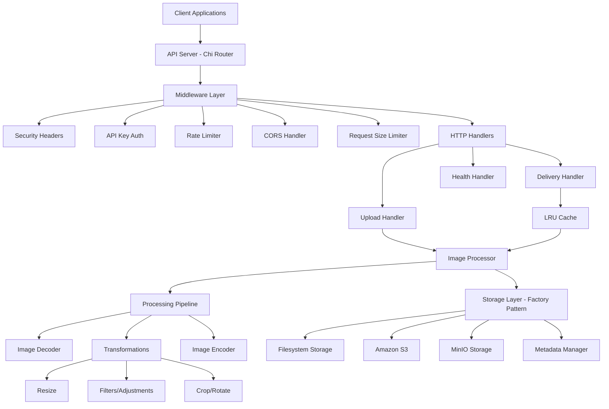

# Imagine - High-Performance Image Processing Service


A blazing-fast image processing service built in Go that serves as a simplified Cloudinary alternative. Designed for maximum performance, scalability, and ease of deployment.

## 🚀 Features

### Core Capabilities
- **RESTful API** with Chi router for lightning-fast routing
- **Multi-format Support** - JPEG, PNG, WebP with WebP as default for optimal compression
- **Dynamic Transformations** - Resize, quality adjustment, format conversion, filters, and more on-the-fly
- **Flexible Storage** - Local filesystem, MinIO, or Amazon S3 storage
- **High Performance** - Concurrent processing with goroutine pools
- **Smart Caching** - In-memory LRU cache for frequently accessed images
- **Content-based Deduplication** - Automatic detection of duplicate images using hash-based IDs

### Production Ready
- **Docker Containerization** with multi-stage builds for minimal image size
- **Health Checks** and monitoring endpoints
- **Graceful Shutdown** with proper resource cleanup
- **Comprehensive Logging** with structured JSON output
- **Security Features** - Input validation, rate limiting, CORS support, API key authentication
- **Configuration Management** - Environment variables and YAML config support

## 📋 Quick Start

### Prerequisites
- Go 1.25+
- Docker & Docker Compose (optional)
- AWS CLI (for S3 storage)
- MinIO (for local object storage testing)

### Installation

```bash
# Clone the repository
git clone https://github.com/birdple/imagine.git
cd imagine

# Install dependencies
go mod download

# Run locally
go run cmd/server/main.go
```

### Docker Quick Start

```bash
# Build and run with Docker
docker build -t imagine-service .
docker run -p 8080:8080 imagine-service

# Or use Docker Compose (recommended)
docker-compose up --build

# With MinIO for object storage
docker-compose --profile with-minio up -d
```

## 🔧 Configuration

### Environment Variables

```bash
# Server Configuration
PORT=8080
HOST=0.0.0.0
ENV=production

# Storage Configuration
STORAGE_PRIMARY=filesystem           # Options: filesystem, s3, minio
STORAGE_LOCAL_PATH=/app/data/images  # For filesystem storage
STORAGE_S3_BUCKET=my-image-bucket    # For S3 storage
STORAGE_S3_REGION=us-west-2
STORAGE_S3_ACCESS_KEY=your-access-key
STORAGE_S3_SECRET_KEY=your-secret-key

# MinIO Configuration
STORAGE_MINIO_ENDPOINT=localhost:9000
STORAGE_MINIO_BUCKET=images
STORAGE_MINIO_ACCESS_KEY=minioadmin
STORAGE_MINIO_SECRET_KEY=minioadmin
STORAGE_MINIO_SECURE=false           # Use SSL/TLS

# Processing Configuration
MAX_FILE_SIZE_MB=10
DEFAULT_QUALITY=85
DEFAULT_FORMAT=webp
CACHE_SIZE_MB=512
CONCURRENT_WORKERS=4

# Security Configuration
API_KEY_REQUIRED=false               # Set to true to enable API key auth for uploads
API_KEY=your-secret-api-key          # Required when API_KEY_REQUIRED=true
CORS_ORIGINS=*                       # Comma-separated list
RATE_LIMIT_RPM=1000                  # Requests per minute (applies to all endpoints)
```

### MinIO Setup

MinIO is an open-source S3-compatible object storage server, perfect for local development and testing:

```bash
# Start MinIO with Docker Compose
docker-compose --profile with-minio up -d

# Access MinIO Console
# URL: http://localhost:9001
# User: minioadmin
# Pass: minioadmin

# Configure the service to use MinIO
export STORAGE_PRIMARY=minio
export STORAGE_MINIO_ENDPOINT=localhost:9000
export STORAGE_MINIO_BUCKET=images
export STORAGE_MINIO_ACCESS_KEY=minioadmin
export STORAGE_MINIO_SECRET_KEY=minioadmin
export STORAGE_MINIO_SECURE=false
```

MinIO provides:
- S3-compatible API
- Web-based console for bucket management
- Perfect for local development and testing
- Production-ready for on-premise deployments

## 📚 API Documentation

### Authentication

The API supports optional API key authentication. When `API_KEY_REQUIRED=false`, no authentication is needed.

#### Without Authentication (Default)

```bash
# cURL
curl -X POST http://localhost:8080/api/v1/upload -F "file=@image.jpg"

# HTTPie
http -f POST localhost:8080/api/v1/upload file@image.jpg
```

#### With API Key Authentication

When `API_KEY_REQUIRED=true`, include the API key in your requests:

```bash
# cURL - Using X-API-Key header
curl -X POST http://localhost:8080/api/v1/upload \
  -H "X-API-Key: your-secret-api-key" \
  -F "file=@image.jpg"

# HTTPie - Using X-API-Key header
http -f POST localhost:8080/api/v1/upload \
  X-API-Key:your-secret-api-key \
  file@image.jpg

# cURL - Using Authorization Bearer token
curl -X POST http://localhost:8080/api/v1/upload \
  -H "Authorization: Bearer your-secret-api-key" \
  -F "file=@image.jpg"

# HTTPie - Using Authorization Bearer token
http -f POST localhost:8080/api/v1/upload \
  Authorization:"Bearer your-secret-api-key" \
  file@image.jpg
```

**Note:**
- The `/health` endpoint is always accessible without authentication
- **Image retrieval/delivery endpoints (`/api/v1/images/{id}`) are always public** - no API key required
- API key is only required for **upload endpoint** (`/api/v1/upload`) when `API_KEY_REQUIRED=true`

### Upload Image

The API supports three upload methods: multipart form-data, direct binary upload, and URL-based upload.

#### Method 1: Multipart Form-Data Upload

```bash
# cURL - Basic upload
curl -X POST http://localhost:8080/api/v1/upload \
  -F "file=@image.jpg"

# HTTPie - Basic upload
http -f POST localhost:8080/api/v1/upload file@image.jpg

# cURL - Upload with transformation parameters
curl -X POST http://localhost:8080/api/v1/upload \
  -F "file=@image.jpg" \
  -F "quality=90" \
  -F "format=webp"

# HTTPie - Upload with transformation parameters
http -f POST localhost:8080/api/v1/upload \
  file@image.jpg \
  quality=90 \
  format=webp

# cURL - With API key (if required)
curl -X POST http://localhost:8080/api/v1/upload \
  -H "X-API-Key: your-secret-api-key" \
  -F "file=@image.jpg" \
  -F "quality=90" \
  -F "format=webp"

# HTTPie - With API key (if required)
http -f POST localhost:8080/api/v1/upload \
  X-API-Key:your-secret-api-key \
  file@image.jpg \
  quality=90 \
  format=webp
```

**Parameters (form fields):**
- `file` (required) - The image file to upload
- `quality` (optional) - Output quality (1-100)
- `format` (optional) - Output format (jpeg, png, webp)

#### Method 2: Direct Binary Upload

```bash
# cURL - Upload raw image data
curl -X POST http://localhost:8080/api/v1/upload \
  -H "Content-Type: image/jpeg" \
  --data-binary "@image.jpg"

# HTTPie - Upload raw image data
http POST localhost:8080/api/v1/upload \
  Content-Type:image/jpeg \
  < image.jpg

# cURL - With transformation parameters (query string)
curl -X POST "http://localhost:8080/api/v1/upload?quality=90&format=webp" \
  -H "Content-Type: image/jpeg" \
  --data-binary "@image.jpg"

# HTTPie - With transformation parameters (query string)
http POST "localhost:8080/api/v1/upload?quality=90&format=webp" \
  Content-Type:image/jpeg \
  < image.jpg

# cURL - With API key
curl -X POST "http://localhost:8080/api/v1/upload?quality=90" \
  -H "X-API-Key: your-secret-api-key" \
  -H "Content-Type: image/png" \
  --data-binary "@image.png"

# HTTPie - With API key
http POST "localhost:8080/api/v1/upload?quality=90" \
  X-API-Key:your-secret-api-key \
  Content-Type:image/png \
  < image.png
```

**Parameters (query string):**
- `quality` (optional) - Output quality (1-100)
- `format` (optional) - Output format (jpeg, png, webp)

#### Method 3: URL-Based Upload

```bash
# cURL - Upload from URL
curl -X POST http://localhost:8080/api/v1/upload \
  -H "Content-Type: application/json" \
  -d '{
    "url": "https://example.com/image.jpg",
    "quality": 85,
    "format": "webp"
  }'

# HTTPie - Upload from URL
http POST localhost:8080/api/v1/upload \
  url=https://example.com/image.jpg \
  quality:=85 \
  format=webp

# cURL - With API key
curl -X POST http://localhost:8080/api/v1/upload \
  -H "X-API-Key: your-secret-api-key" \
  -H "Content-Type: application/json" \
  -d '{
    "url": "https://example.com/image.jpg",
    "quality": 90
  }'

# HTTPie - With API key
http POST localhost:8080/api/v1/upload \
  X-API-Key:your-secret-api-key \
  url=https://example.com/image.jpg \
  quality:=90
```

**JSON Payload:**
- `url` (required) - URL of the image to download and process
- `quality` (optional) - Output quality (1-100)
- `format` (optional) - Output format (jpeg, png, webp)

**HTTPie Note:** Use `:=` for numbers (e.g., `quality:=90`) and `=` for strings (e.g., `format=webp`)

**Upload Response:**
```json
{
  "success": true,
  "data": {
    "id": "img_a1b2c3d4e5f6",
    "url": "/api/v1/images/img_a1b2c3d4e5f6",
    "original_name": "image.jpg",
    "format": "webp",
    "size": 1024576,
    "dimensions": {
      "width": 1920,
      "height": 1080
    },
    "created_at": "2024-01-01T00:00:00Z"
  }
}
```

**Note:** Images are deduplicated based on content hash. If you upload the same image twice, you'll receive a 200 OK with the existing image data instead of creating a duplicate.

### Retrieve and Transform Images

**Important:** Image retrieval endpoints are **always public** and do not require authentication. This allows you to share image URLs freely.

```bash
# cURL - Get original image
curl http://localhost:8080/api/v1/images/img_a1b2c3d4e5f6

# HTTPie - Get original image
http --download localhost:8080/api/v1/images/img_a1b2c3d4e5f6

# cURL - Get resized image (short parameters)
curl "http://localhost:8080/api/v1/images/img_a1b2c3d4e5f6?w=800&h=600&q=90&f=jpeg"

# HTTPie - Get resized image (short parameters)
http --download "localhost:8080/api/v1/images/img_a1b2c3d4e5f6?w=800&h=600&q=90&f=jpeg"

# cURL - Get resized image (long parameters)
curl "http://localhost:8080/api/v1/images/img_a1b2c3d4e5f6?width=800&height=600&quality=90&format=webp"

# HTTPie - Get resized image (long parameters)
http --download "localhost:8080/api/v1/images/img_a1b2c3d4e5f6?width=800&height=600&quality=90&format=webp"

# cURL - Mix short and long parameters
curl "http://localhost:8080/api/v1/images/img_a1b2c3d4e5f6?w=800&height=600&q=85"

# HTTPie - Mix short and long parameters
http --download "localhost:8080/api/v1/images/img_a1b2c3d4e5f6?w=800&height=600&q=85"
```

**Note:** No authentication required foage retrieval. URLs can be shared publicly and embedded in websites, apps, or CDNs.

#### Basic Transformation Parameters

| Short | Long | Type | Range | Description |
|-------|------|------|-------|-------------|
| `w` | `width` | int | 1-8000 | Target width in pixels |
| `h` | `height` | int | 1-8000 | Target height in pixels |
| `q` | `quality` | int | 1-100 | Outpuality (higher = better quality, larger file) |
| `f` | `format` | string | jpeg, png, webp | Output format |
| - | `fit` | string | cover, contain, fill | Resize mode |

**Resize Modes (`fit` parameter):**
- `cover` - Resize to cover dimensions, cropping if needed (default)
- `contain` - Resize to fit within dimensions, maintaining aspect ratio
- `fill` - Resize and stretch to exact dimons

#### Advanced Transformation Parameters

**Cropping:**
- `crop_x` - X coordinate for crop start (pixels)
- `crop_y` - Y coordinate for crop start (ls)
- `crop_w` - Crop width (pixels)
- `crop_h` - Crop height (pixels)

```bash
# cURL - Crop 500x500 region starting at (100, 100)
curl "http://localhost:8080/api/v1/images/img_abc?crop_x=100&crop_y=100&crop_w=500&crop_h=500"

# HTTPie - Crop 500x500 region starting at (100, 100)
http --download "localhost:8080/api/v1/images/img_abc?crop_x=100&crop_y=100&crop_w=500&crop_h=500"
```

**Rotation and Flipping:**
- `rotate` - Rotation angle in degrees (0-360)
- `flip` - Flip direction: `horizontal` or `vertical`
- `flop` - Horizontal flip (boolean: true/false)

```bash
# cURL - Rotate 90 degrees
curl "http://localhost:8080/api/v1/images/img_abc?rotate=90"

# HTTPie - Rotate 90 degrees
http --download "localhost:8080/api/v1/images/img_abc?rotate=90"

# cURL - Flip horizontally
curl "http://localhost:8080/api/v1/images/img_abc?flip=horizontal"

# HTTPie - Flip horizontally
http --download "localhost:8080/api/v1/images/img_abc?flip=horizontal"
```

**Color Adjustments:**
- `brightness` - Brightness adjustment (-100 to 100)
- `contrast` - Contrast adjustment (-100 t0)
- `saturation` - Saturation adjustment (-100 to 500)
- `gamma` - Gamma correction (0 to 3)
- `hue` - Hue rotation (-180 to 180 degrees)

```bash
# cURL - Increase brightness and saturation
curl "http://localhost:8080/api/v1/images/img_abc?brightness=20&saturation=30"

# HTTPie - Increase brightness and saturation
http --download "localhost:8080/api/v1/images/img_abc?brightness=20&saturation=30"

# cURL - Adjust gamma
curl "http://localhost:8080/api/v1/images/abc?gamma=1.5"

# HTTPie - Adjust gamma
http --download "localhost:8080/api/v1/images/abc?gamma=1.5"
```

**Filters:**
- `blur` - Blur amount (0 to 100)
- `sharpen` - Sharpen amount (0 to 100)

```bash
# cURL - Apply blur
curl "http://localhost:8080/api/v1/images/img_abc?blur=5"

# HTTPie - Apply blur
http --download "localhost:8080/api/v1/images/img_abc?blur=5"

# cURL - Sharpen image
curl "http://localhost:8080/api/v1/images/img_abc?sharpen=2"

# HTTPie - Sharpen image
http --download "localhost:8080/api/v1/imaimg_abc?sharpen=2"
```

#### Complex Transformation Examples

```bash
# cURL - Resize, convert to WebP, and adjuolors
curl "http://localhost:8080/api/v1/images/img_abc?w=1200&h=800&f=webp&q=85&brightness=10&contrast=5"

# HTTPie - Resize, convert to WebP, and adjustors
http --download "localhost:8080/api/v1/images/img_abc?w=1200&h=800&f=webp&q=85&brightness=10&contrast=5"

# cURL - Create thumbnail with crop and blur
curl "http://localhost:8080/api/v1/images/img_abc?w=300&h=300&fit=cover&blur=2&sharpen=1"

# HTTPie - Create thumbnail with crop and blur
http --download "localhost:8080/api/v1/images/img_abc?w=300&h=300&fit=cover&blur=2&sharpen=1"

# cURL - Full transformation pipeline
curl "http://localhost:8080/api/v1/images/img_abc?crop_x=100&crop_y=100&crop_w=800&crop_h=600&w=400&rotate=90&brightness=15&saturation=20&blur=1&f=webp&q=90"

# HTTPie - Full transformation pipeline
http --download "localhost:8080/api/v1/images/img_abc?crop_x=100&crop_y=100&crop_w=800&crop_h=600&w=400&rotate=90&brightness=15&saturation=20&blur=1&f=webp&q=90"
```

### Health Check

```bash
# cURL
curl http://localhost:8080/health

# HTTPie
http localhost:8080/health
```

**Response:**
```json
{
  "status": "healthy",
  "timestamp": "2024-01-01T00:00:00Z",
  "version": "1.0.0",
  "uptime": "unknown",
  "storage": {
    "status": "healthy",
    "total_images": 1523,
    "total_size": 1073741824,
    "free_space": 107374182400
  }
}
```

## 🏗️ Architecture

### System Overview



### Key Architectural Patterns

1. **Factory Pattern** - Storage backend creation and registration
2. **Pipeline Pattern** - Composable image transformations
3. **Interface Segregation** - Small, focused interfaces (Reader, Writer, Deleter, HealthChecker, StatsProvider)
4. **Dependency Injection** - All dependencies injected via interfaces
5. **Middleware Chain** - Composable HTTP middleware for security, logging, rate limiting

### Project Structure

```
imagine/
├── cmd/server/
│   └── main.go                     # Application entry point
├── internal/
│   ├── api/                        # HTTP layer
│   │   ├── handlers.go             # Request handlers (upload, delivery, health)
│   │   ├── server.go               # Server setup and middleware
│   │   └── middleware/             # HTTP middleware
│   │       └── security.go         # Auth, rate limiting, security headers
│   ├── config/                     # Configuration management (SOLID refactored)
│   │   ├── config.go               # Main config loader
│   │   ├── types.go                # Configuration types
│   │   ├── loader.go               # Config loading logic
│   │   ├── validator.go            # Config validation
│   │   ├── defaults.go             # Default values
│   │   └── helpers.go              # Helper functions
│   ├── storage/                    # Storage backends (ISP pattern)
│   │   ├── interfaces.go           # Segregated interfaces
│   │   ├── factory.go              # Factory pattern with registration
│   │   ├── metadata.go             # Metadata encoder/decoder (DRY)
│   │   ├── filesystem.go           # Local filesystem implementation
│   │   ├── s3.go                   # Amazon S3 implementation
│   │   ├── minio.go                # MinIO implementation
│   │   └── errors.go               # Storage-specific errors
│   ├── processor/                  # Image processing (Pipeline pattern)
│   │   ├── processor.go            # Main processor orchestrator
│   │   ├── pipeline.go             # Pipeline pattern implementation
│   │   ├── transformations.go     # Pure transformation functions
│   │   ├── decoder.go              # Image decoding
│   │   ├── encoder.go              # Image encoding
│   │   └── interface.go            # Processor interfaces
│   ├── cache/                      # Caching layer
│   │   └── lru.go                  # LRU cache implementation
│   └── pkg/                        # Shared packages (DRY)
│       ├── httputil/               # HTTP utilities
│       │   ├── client.go           # Client IP, User Agent extraction
│       │   └── response.go         # JSON response helpers
│       └── hashutil/               # Hashing utilities
│           └── hash.go             # Image ID generation from content
├── tests/
│   ├── integration/                # Integration tests
│   │   ├── cache_test.go
│   │   ├── security_test.go
│   │   └── minio_test.go
│   └── unit/                       # Unit tests
│       └── processor_test.go
├── configs/
│   └── config.yaml                 # YAML configuration
├── deployments/
│   └── nginx/                      # Nginx configs for reverse proxy
├── docs/                           # Additional documentation
├── docker-compose.yml              # Docker Compose setup
├── Dockerfile                      # Multi-stage Docker build
├── REFACTORING.md                  # Refactoring documentation
├── DEDUPLICATION.md                # Deduplication implementation details
└── README.md                       # This file
```

**Recent Refactoring (2025-10-08):**
- Applied SOLID principles (SRP, OCP, LSP, ISP, DIP)
- Implemented DRY (Don't Repeat Yourself) and KISS (Keep It Simple, Stupid)
- Factory Pattern for storage backends
- Pipeline Pattern for image transformations
- Interface Segregation for better testability
- See [REFACTORING.md](REFACTORING.md) for details

## 🚀 Performance

### Benchmarks
- **Upload Processing**: < 2 seconds for 10MB files
- **Cached Delivery**: < 100ms response time
- **Uncached Delivery**: < 1 second processing time
- **Throughput**: 1000+ requests/second for image delivery
- **Memory Usage**: < 1GB per instance under normal load

### Optimization Features
- Concurrent image processing with worker pools
- Streaming file uploads for memory efficiency
- Smart caching with LRU eviction
- WebP format for optimal compression (30-50% smaller than JPEG)
- Connection pooling for storage backends
- Content-based deduplication to save storage space

## 🔒 Security

### Built-in Security Features
- **Input Validation** - File type validation using magic numbers
- **Size Limits** - Configurable file size restrictions (default 10MB)
- **Rate Limiting** - Per-client request throttling (configurable RPM, applies to all endpoints)
- **CORS Support** - Configurable cross-origin policies
- **Secure Headers** - X-Frame-Options, CSP, X-Content-Type-Options, etc.
- **API Key Authentication** - Optional API key protection for uploads only (images are publicly accessible)

### Security Best Practices
- Non-root container execution
- Minimal attack surface with Alpine Linux base
- Secure file storage paths
- Input sanitization and validation
- Error message sanitization
- HTTPS support via reverse proxy (Nginx)

### Rate Limiting

When rate limits are exceeded, you'll receive:

```
HTTP/1.1 429 Too Many Requests
X-RateLimit-Limit: 1000
X-RateLimit-Remaining: 0
Retry-After: 60

Too Many Requests
```

## 📊 Monitoring

### Health Monitoring
- Service health endpoint with detailed status
- Storage backend health checks
- Cache performance metrics
- Memory and CPU usage tracking

### Logging
- Structured JSON logging for production (configurable)
- Request/response logging with correlation IDs
- Error tracking and alerting
- Performance metrics logging
- Security event logging (failed auth attempts, rate limits, etc.)

### Metrics (Optional)
- Prometheus metrics endpoint (when enabled)
- Custom application metrics
- Request latency histograms
- Error rate monitoring

## 🐳 Deployment

### Docker Deployment

```bash
# Build production image
docker build -t imagine-service .

# Run container
docker run -d \
  -p 8080:8080 \
  -v $(pwd)/data:/app/data \
  -e STORAGE_PRIMARY=filesystem \
  -e API_KEY_REQUIRED=true \
  -e API_KEY=your-secret-key \
  --name imagine \
  imagine-service
```

### Docker Compose Deployment

```bash
# Basic deployment
docker-compose up -d

# With MinIO
docker-compose --profile with-minio up -d

# With all optional services
docker-compose --profile with-minio --profile with-redis --profile with-db up -d

# With Nginx reverse proxy
docker-compose --profile with-nginx up -d
```

### Kubernetes Deployment

```yaml
apiVersion: apps/v1
kind: Deployment
metadata:
  name: imagine-service
spec:
  replicas: 3
  selector:
    matchLabels:
      app: imagine-service
  template:
    metadata:
      labels:
        app: imagine-service
    spec:
      containers:
      - name: imagine
        image: imagine-service:latest
        ports:
        - containerPort: 8080
        env:
        - name: STORAGE_PRIMARY
          value: "s3"
        - name: API_KEY_REQUIRED
          value: "true"
        - name: API_KEY
          valueFrom:
            secretKeyRef:
              name: imagine-secrets
              key: api-key
        resources:
          requests:
            memory: "512Mi"
            cpu: "500m"
          limits:
            memory: "1Gi"
            cpu: "1000m"
        livenessProbe:
          httpGet:
            path: /health
            port: 8080
          initialDelaySeconds: 30
          periodSeconds: 10
        readinessProbe:
          httpGet:
            path: /health
            port: 8080
          initialDelaySeconds: 5
          periodSeconds: 5
```

### Cloud Deployment Options
- **AWS ECS/Fargate** - Serverless container deployment
- **Google Cloud Run** - Fully managed serverless platform
- **Azure Container Instances** - Simple container deployment
- **DigitalOcean App Platform** - Platform-as-a-Service deployment
- **Coolify** - Open-source self-hosted platform
- **Dokploy** - Open-source Docker deployment platform

## 🧪 Testing

### Test Coverage
- Unit tests for all core components
- Integration tests for API endpoints
- Performance tests for load scenarios
- Security tests for input validation

### Running Tests

```bash
# Using Go commands
go test ./...                                      # Run all tests
go test -v ./...                                   # Verbose output
go test -cover ./...                               # Run with coverage
go test -coverprofile=coverage.out ./...           # Generate coverage file
go tool cover -html=coverage.out                   # View coverage in browser
go test -tags=integration ./tests/integration/...  # Run integration tests
go test ./internal/processor/...                   # Run specific package tests
go test -bench=. -benchmem ./...                   # Run performance benchmarks

# Using Make commands
make test                # Run all tests
make test-coverage       # Run tests with HTML coverage report
make test-integration    # Run integration tests
make test-performance    # Run performance benchmarks
```

## 🛠️ Development

### Building the Project

```bash
# Using Go commands
go build -o bin/imagine-server cmd/server/main.go           # Build for current OS
CGO_ENABLED=0 GOOS=linux go build -o bin/imagine cmd/...    # Build for Linux
go run cmd/server/main.go                                   # Run without building

# Using Make commands
make build               # Build for Linux (production)
make build-local         # Build for local OS
make run                 # Run the application
make dev                 # Run with hot reload (requires air)
```

### Code Quality

```bash
# Using Go commands
go fmt ./...                   # Format code
go vet ./...                   # Run go vet
goimports -w .                 # Organize imports
golangci-lint run              # Run linter

# Using Make commands
make fmt                 # Format code and organize imports
make vet                 # Run go vet
make lint                # Run golangci-lint
```

### Docker Commands

```bash
# Using Docker commands
docker build -t imagine-service .
docker run -p 8080:8080 --env-file .env imagine-service
docker-compose up --build
docker-compose down

# Using Make commands
make docker-build        # Build Docker image
make docker-run          # Build and run Docker container
make docker-compose-up   # Run with docker-compose
make docker-compose-down # Stop docker-compose services
```

### Development Setup

```bash
# Using Go commands
go mod download                                            # Install dependencies
go install github.com/cosmtrek/air@latest                  # Install air (hot reload)
go install golang.org/x/tools/cmd/goimports@latest         # Install goimports
go install github.com/golangci/golangci-lint/cmd/golangci-lint@latest  # Install linter

# Using Make commands
make setup               # Install all development dependencies
make dev-setup           # Complete development environment setup (includes .env, directories)
make clean               # Clean build artifacts and data
make health              # Check if service is running
make help                # Show all available make commands
```

**Quick Start for Development:**

```bash
# Complete setup
make dev-setup

# Run with hot reload
make dev

# In another terminal - run tests on file changes
make test
```

## 📖 Documentation

- [README.md](README.md) - This file, complete API and setup guide
- [REFACTORING.md](REFACTORING.md) - Detailed refactoring documentation (SOLID, DRY, KISS)
- [DEDUPLICATION.md](DEDUPLICATION.md) - Content-based deduplication implementation
- [COLLISION_ANALYSIS.md](COLLISION_ANALYSIS.md) - Hash collision analysis and mitigation

## 🤝 Contributing

1. Fork the repository
2. Create a feature branch (`git checkout -b feature/amazing-feature`)
3. Commit your changes (`git commit -m 'Add amazing feature'`)
4. Push to the branch (`git push origin feature/amazing-feature`)
5. Open a Pull Request

### Contribution Workflow

```bash
# Setup your development environment
make dev-setup

# Create a new branch
git checkout -b feature/amazing-feature

# Make your changes and test
make test
make lint

# Format your code
make fmt

# Build to ensure it compiles
make build-local

# Commit and push
git add .
git commit -m 'Add amazing feature'
git push origin feature/amazing-feature
```

## 📄 License

This project is licensed under the MIT License - see the [LICENSE](LICENSE) file for details.

## 🙏 Acknowledgments

- [Chi Router](https://github.com/go-chi/chi) - Lightweight HTTP router
- [Imaging](https://github.com/disintegration/imaging) - Image processing library
- [WebP](https://github.com/chai2010/webp) - WebP format support
- [AWS SDK](https://github.com/aws/aws-sdk-go-v2) - AWS integration
- [MinIO](https://min.io/) - High-performance S3-compatible object storage

## 📞 Support

- 📧 Email: support@imagine-service.com
- 🐛 Issues: [GitHub Issues](https://github.com/birdple/imagine/issues)
- 📖 Documentation: [Wiki](https://github.com/birdple/imagine/wiki)
- 💬 Discussions: [GitHub Discussions](https://github.com/birdple/imagine/discussions)

---

**Built with ❤️ in Go for maximum performance and reliability.**
