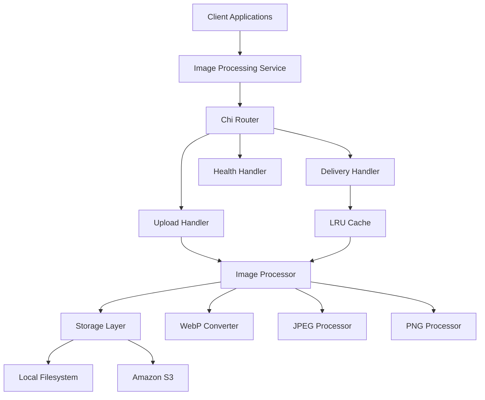

# Imagine - High-Performance Image Processing Service


A blazing-fast image processing service built in Go that serves as a simplified Cloudinary alternative. Designed for maximum performance, scalability, and ease of deployment.

## 🚀 Features

### Core Capabilities
- **RESTful API** with Chi router for lightning-fast routing
- **Multi-format Support** - JPEG, PNG, WebP with WebP as default for optimal compression
- **Dynamic Transformations** - Resize, quality adjustment, format conversion on-the-fly
- **Flexible Storage** - Local filesystem primary with S3 secondary storage
- **High Performance** - Concurrent processing with goroutine pools
- **Smart Caching** - In-memory LRU cache for frequently accessed images

### Production Ready
- **Docker Containerization** with multi-stage builds for minimal image size
- **Health Checks** and monitoring endpoints
- **Graceful Shutdown** with proper resource cleanup
- **Comprehensive Logging** with structured JSON output
- **Security Features** - Input validation, rate limiting, CORS support
- **Configuration Management** - Environment variables and YAML config support

## 📋 Quick Start

### Prerequisites
- Go 1.21+
- Docker (optional)
- AWS CLI (for S3 storage)

### Installation

```bash
# Clone the repository
git clone https://github.com/ivangsm/imagine.git
cd imagine

# Install dependencies
go mod download

# Run locally
go run cmd/server/main.go
```

### Docker Quick Start

```bash
# Build and run with Docker
docker build -t imagine-service .
docker run -p 8080:8080 imagine-service

# Or use Docker Compose
docker-compose up --build
```

## 🔧 Configuration

### Environment Variables

```bash
# Server Configuration
PORT=8080
HOST=0.0.0.0
ENV=production

# Storage Configuration
STORAGE_PRIMARY=filesystem
STORAGE_LOCAL_PATH=/app/data/images
STORAGE_S3_BUCKET=my-image-bucket
STORAGE_S3_REGION=us-west-2

# Processing Configuration
MAX_FILE_SIZE_MB=10
DEFAULT_QUALITY=85
DEFAULT_FORMAT=webp
CACHE_SIZE_MB=512
```

See [DEPLOYMENT_GUIDE.md](DEPLOYMENT_GUIDE.md) for complete configuration options.

## 📚 API Documentation

### Upload Image

```bash
# Upload file
curl -X POST http://localhost:8080/api/v1/upload \
  -F "file=@image.jpg" \
  -F "quality=90" \
  -F "format=webp"

# Upload from URL
curl -X POST http://localhost:8080/api/v1/upload \
  -H "Content-Type: application/json" \
  -d '{"url": "https://example.com/image.jpg", "quality": 85}'
```

**Response:**
```json
{
  "success": true,
  "data": {
    "id": "img_1234567890abcdef",
    "url": "/api/v1/images/img_1234567890abcdef",
    "format": "webp",
    "size": 1024576,
    "dimensions": {
      "width": 1920,
      "height": 1080
    }
  }
}
```

### Retrieve Image

```bash
# Get original image
curl http://localhost:8080/api/v1/images/img_1234567890abcdef

# Get resized image
curl "http://localhost:8080/api/v1/images/img_1234567890abcdef?w=800&h=600&q=90&f=jpeg"
```

**Query Parameters:**
- `w` - Width in pixels
- `h` - Height in pixels
- `q` - Quality (1-100)
- `f` - Format (jpeg, png, webp)
- `fit` - Resize mode (cover, contain, fill)

### Health Check

```bash
curl http://localhost:8080/health
```

**Response:**
```json
{
  "status": "healthy",
  "timestamp": "2024-01-01T00:00:00Z",
  "version": "1.0.0",
  "storage": {
    "local": "available",
    "s3": "available"
  },
  "cache": {
    "hit_ratio": 0.85,
    "size": "256MB"
  }
}
```

## 🏗️ Architecture

### System Overview



### Project Structure

```
imagine/
├── cmd/server/main.go              # Application entry point
├── internal/
│   ├── api/                        # HTTP layer
│   │   ├── handlers/               # Request handlers
│   │   ├── middleware/             # HTTP middleware
│   │   └── router.go               # Route definitions
│   ├── config/                     # Configuration management
│   ├── storage/                    # Storage backends
│   ├── processor/                  # Image processing
│   ├── cache/                      # Caching layer
│   └── logger/                     # Logging utilities
├── pkg/utils/                      # Shared utilities
├── configs/                        # Configuration files
├── deployments/                    # Docker and K8s configs
├── docs/                          # Documentation
└── tests/                         # Test suites
```

## 🚀 Performance

### Benchmarks
- **Upload Processing**: < 2 seconds for 10MB files
- **Cached Delivery**: < 100ms response time
- **Uncached Delivery**: < 1 second processing time
- **Throughput**: 1000+ requests/second for image delivery
- **Memory Usage**: < 1GB per instance under normal load

### Optimization Features
- Concurrent image processing with worker pools
- Streaming file uploads for memory efficiency
- Smart caching with LRU eviction
- WebP format for optimal compression
- Connection pooling for storage backends

## 🔒 Security

### Built-in Security Features
- **Input Validation** - File type validation using magic numbers
- **Size Limits** - Configurable file size restrictions
- **Rate Limiting** - Per-client request throttling
- **CORS Support** - Configurable cross-origin policies
- **Secure Headers** - Security headers in responses
- **API Key Authentication** - Optional API key protection

### Security Best Practices
- Non-root container execution
- Minimal attack surface with Alpine Linux base
- Secure file storage paths
- Input sanitization and validation
- Error message sanitization

## 📊 Monitoring

### Health Monitoring
- Service health endpoint with detailed status
- Storage backend health checks
- Cache performance metrics
- Memory and CPU usage tracking

### Logging
- Structured JSON logging for production
- Request/response logging with correlation IDs
- Error tracking and alerting
- Performance metrics logging

### Metrics (Optional)
- Prometheus metrics endpoint
- Custom application metrics
- Request latency histograms
- Error rate monitoring

## 🐳 Deployment

### Docker Deployment

```dockerfile
# Multi-stage build for minimal image size
FROM golang:1.21-alpine AS builder
# ... build stage

FROM alpine:3.18 AS production
# ... production stage with security hardening
```

### Kubernetes Deployment

```yaml
apiVersion: apps/v1
kind: Deployment
metadata:
  name: imagine-service
spec:
  replicas: 3
  selector:
    matchLabels:
      app: imagine-service
  template:
    # ... pod template with resource limits and health checks
```

### Cloud Deployment Options
- **AWS ECS/Fargate** - Serverless container deployment
- **Google Cloud Run** - Fully managed serverless platform
- **Azure Container Instances** - Simple container deployment
- **DigitalOcean App Platform** - Platform-as-a-Service deployment

## 🧪 Testing

### Test Coverage
- Unit tests for all core components
- Integration tests for API endpoints
- Performance tests for load scenarios
- Security tests for input validation

### Running Tests

```bash
# Run all tests
make test

# Run with coverage
make test-coverage

# Run integration tests
make test-integration

# Run performance tests
make test-performance
```

## 📖 Documentation

- [Architecture Overview](ARCHITECTURE.md) - Detailed system architecture
- [Technical Specification](TECHNICAL_SPEC.md) - Implementation details and API specs
- [Deployment Guide](DEPLOYMENT_GUIDE.md) - Production deployment instructions
- [API Documentation](docs/API.md) - Complete API reference
- [Configuration Reference](docs/CONFIGURATION.md) - All configuration options

## 🤝 Contributing

1. Fork the repository
2. Create a feature branch (`git checkout -b feature/amazing-feature`)
3. Commit your changes (`git commit -m 'Add amazing feature'`)
4. Push to the branch (`git push origin feature/amazing-feature`)
5. Open a Pull Request

### Development Setup

```bash
# Install development dependencies
make dev-setup

# Run with hot reload
make dev

# Run linting
make lint

# Format code
make fmt
```

## 📄 License

This project is licensed under the MIT License - see the [LICENSE](LICENSE) file for details.

## 🙏 Acknowledgments

- [Chi Router](https://github.com/go-chi/chi) - Lightweight HTTP router
- [Imaging](https://github.com/disintegration/imaging) - Image processing library
- [WebP](https://github.com/chai2010/webp) - WebP format support
- [AWS SDK](https://github.com/aws/aws-sdk-go-v2) - AWS integration

## 📞 Support

- 📧 Email: support@imagine-service.com
- 🐛 Issues: [GitHub Issues](https://github.com/ivangsm/imagine/issues)
- 📖 Documentation: [Wiki](https://github.com/ivangsm/imagine/wiki)
- 💬 Discussions: [GitHub Discussions](https://github.com/ivangsm/imagine/discussions)

---

**Built with ❤️ in Go for maximum performance and reliability.**