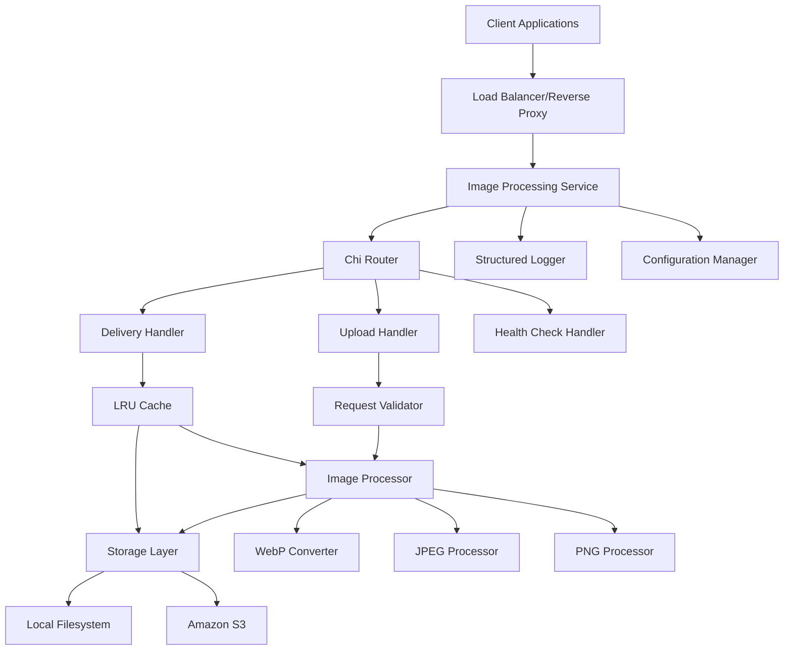

# Image Processing Service Architecture

## Overview

A high-performance image processing service built in Go that serves as a simplified Cloudinary alternative. The service provides RESTful APIs for image upload, processing, and delivery with support for multiple formats, transformations, and storage backends.

## System Architecture



## Core Components

### 1. HTTP Layer
- **Chi Router**: Lightweight, fast HTTP router
- **Middleware Stack**: Logging, CORS, rate limiting, request validation
- **Handlers**: Upload, delivery, health check endpoints

### 2. Image Processing Pipeline
- **Format Detection**: Automatic input format detection
- **Transformation Engine**: Resize, quality adjustment, format conversion
- **WebP Optimization**: Default WebP output for optimal compression
- **Concurrent Processing**: Goroutine-based parallel processing

### 3. Storage Abstraction
- **Interface-based Design**: Pluggable storage backends
- **Local Filesystem**: Primary storage with configurable paths
- **Amazon S3**: Optional secondary storage with fallback
- **Storage Strategy**: Configurable primary/secondary storage selection

### 4. Caching System
- **In-Memory LRU Cache**: Fast access to frequently requested images
- **Cache Key Strategy**: Based on image ID + transformation parameters
- **Memory Management**: Configurable cache size and TTL

### 5. Configuration Management
- **Environment Variables**: Runtime configuration
- **YAML/JSON Config**: Structured configuration files
- **Hot Reload**: Configuration updates without restart

## API Endpoints

### Upload Endpoint
```
POST /api/v1/upload
Content-Type: multipart/form-data

Parameters:
- file: Image file (multipart)
- url: Remote image URL (alternative to file)
- quality: Output quality (1-100, default: 85)
- format: Output format (jpeg, png, webp, default: webp)

Response:
{
  "id": "unique-image-id",
  "url": "/api/v1/images/{id}",
  "format": "webp",
  "size": 1024576,
  "dimensions": {
    "width": 1920,
    "height": 1080
  }
}
```

### Delivery Endpoint
```
GET /api/v1/images/{id}

Query Parameters:
- w: Width (pixels)
- h: Height (pixels)
- q: Quality (1-100)
- f: Format (jpeg, png, webp)

Response:
- Image binary data with appropriate Content-Type header
- Cache-Control headers for browser caching
```

### Health Check Endpoint
```
GET /health

Response:
{
  "status": "healthy",
  "timestamp": "2024-01-01T00:00:00Z",
  "version": "1.0.0",
  "storage": {
    "local": "available",
    "s3": "available"
  }
}
```

## Project Structure

```
imagine/
├── cmd/
│   └── server/
│       └── main.go                 # Application entry point
├── internal/
│   ├── api/
│   │   ├── handlers/
│   │   │   ├── upload.go          # Upload endpoint handler
│   │   │   ├── delivery.go        # Image delivery handler
│   │   │   └── health.go          # Health check handler
│   │   ├── middleware/
│   │   │   ├── logging.go         # Request logging middleware
│   │   │   ├── cors.go            # CORS middleware
│   │   │   └── validation.go      # Request validation
│   │   └── router.go              # Chi router setup
│   ├── config/
│   │   └── config.go              # Configuration management
│   ├── storage/
│   │   ├── interface.go           # Storage interface
│   │   ├── filesystem.go          # Local filesystem storage
│   │   └── s3.go                  # Amazon S3 storage
│   ├── processor/
│   │   ├── image.go               # Image processing pipeline
│   │   ├── formats.go             # Format conversion
│   │   └── transforms.go          # Image transformations
│   ├── cache/
│   │   └── lru.go                 # LRU cache implementation
│   └── logger/
│       └── logger.go              # Structured logging
├── pkg/
│   └── utils/
│       ├── hash.go                # Utility functions
│       └── validation.go          # Input validation
├── configs/
│   ├── config.yaml                # Default configuration
│   └── docker.yaml                # Docker-specific config
├── deployments/
│   ├── Dockerfile                 # Multi-stage Docker build
│   ├── docker-compose.yml         # Local development setup
│   └── k8s/                       # Kubernetes manifests
├── scripts/
│   ├── build.sh                   # Build scripts
│   └── deploy.sh                  # Deployment scripts
├── tests/
│   ├── integration/               # Integration tests
│   └── unit/                      # Unit tests
├── docs/
│   ├── API.md                     # API documentation
│   └── DEPLOYMENT.md              # Deployment guide
├── go.mod
├── go.sum
├── README.md
└── Makefile
```

## Technology Stack

### Core Dependencies
- **Chi Router**: `github.com/go-chi/chi/v5` - HTTP router
- **Image Processing**: `github.com/disintegration/imaging` - Image manipulation
- **WebP Support**: `github.com/chai2010/webp` - WebP encoding/decoding
- **AWS SDK**: `github.com/aws/aws-sdk-go-v2` - S3 integration
- **Configuration**: `github.com/spf13/viper` - Configuration management
- **Logging**: `github.com/sirupsen/logrus` - Structured logging

### Development Dependencies
- **Testing**: `github.com/stretchr/testify` - Testing framework
- **Mocking**: `github.com/golang/mock` - Mock generation
- **Linting**: `golangci-lint` - Code quality

## Performance Considerations

### Concurrency
- Goroutine pools for image processing
- Channel-based work distribution
- Context-based request cancellation

### Memory Management
- Streaming file uploads for large images
- Memory-efficient image processing
- Garbage collection optimization

### Caching Strategy
- LRU cache with configurable size limits
- Cache warming for popular images
- Cache invalidation on image updates

### Resource Limits
- Maximum file size limits
- Request timeout configuration
- Memory usage monitoring

## Security Features

### Input Validation
- File type validation (magic number checking)
- File size limits
- Malicious file detection

### Access Control
- API key authentication (optional)
- Rate limiting per client
- CORS configuration

### Data Protection
- Secure file storage paths
- Input sanitization
- Error message sanitization

## Monitoring and Observability

### Logging
- Structured JSON logging
- Request/response logging
- Error tracking and alerting

### Metrics
- Request count and latency
- Cache hit/miss ratios
- Storage operation metrics
- Memory and CPU usage

### Health Checks
- Service health endpoint
- Storage backend health
- Dependency health checks

## Deployment Strategy

### Docker Containerization
- Multi-stage build for minimal image size
- Non-root user execution
- Health check integration
- Environment variable configuration

### Configuration Management
- Environment-based configuration
- Secrets management
- Configuration validation

### Scaling Considerations
- Stateless service design
- Horizontal scaling ready
- Load balancer compatibility
- Shared storage for multi-instance deployments