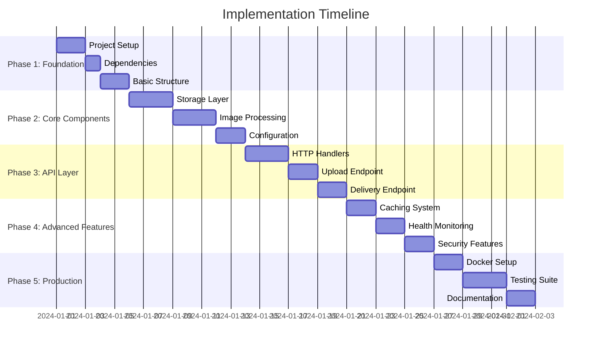

# Implementation Roadmap - Image Processing Service

## Phase-by-Phase Development Guide

This roadmap provides detailed implementation guidance for building the high-performance image processing service. Each phase builds upon the previous one, ensuring a systematic and robust development process.

## 🎯 Development Phases Overview



## Phase 1: Foundation Setup (Days 1-5)

### 1.1 Project Structure and Dependencies

**Objective**: Establish the basic project structure and install required dependencies.

**Tasks**:
1. Initialize Go module and project structure
2. Install core dependencies
3. Set up development tooling
4. Create basic configuration files

**Implementation Steps**:

```bash
# 1. Initialize project structure
mkdir -p {cmd/server,internal/{api/{handlers,middleware},config,storage,processor,cache,logger},pkg/utils,configs,deployments,docs,tests/{unit,integration}}

# 2. Update go.mod with dependencies
go mod init github.com/birdple/falco
```

**Key Dependencies to Add**:
```go
// Core dependencies
github.com/go-chi/chi/v5 v5.0.10
github.com/disintegration/imaging v1.6.2
github.com/chai2010/webp v1.1.1
github.com/aws/aws-sdk-go-v2 v1.21.0
github.com/spf13/viper v1.16.0
github.com/sirupsen/logrus v1.9.3

// Development dependencies
github.com/stretchr/testify v1.8.4
github.com/golang/mock v1.6.0
```

**Deliverables**:
- [ ] Complete project directory structure
- [ ] Updated `go.mod` with all dependencies
- [ ] Basic `Makefile` with common commands
- [ ] `.gitignore` file with Go-specific exclusions
- [ ] Development environment setup

### 1.2 Basic Configuration Framework

**Objective**: Create a flexible configuration system supporting environment variables and YAML files.

**Implementation Priority**:
1. Configuration struct definitions
2. Environment variable loading
3. YAML file support
4. Configuration validation

**Key Files to Create**:
- `internal/config/config.go` - Configuration structures and loading
- `configs/config.yaml` - Default configuration
- `.env.example` - Environment variable template

## Phase 2: Core Components (Days 6-13)

### 2.1 Storage Abstraction Layer

**Objective**: Implement a flexible storage system supporting local filesystem and S3.

**Implementation Steps**:

1. **Storage Interface Design**:
```go
// internal/storage/interface.go
type StorageBackend interface {
    Store(ctx context.Context, key string, data io.Reader, metadata *ImageMetadata) error
    Retrieve(ctx context.Context, key string) (io.ReadCloser, *ImageMetadata, error)
    Delete(ctx context.Context, key string) error
    Exists(ctx context.Context, key string) (bool, error)
    Health(ctx context.Context) error
}
```

2. **Local Filesystem Implementation**:
   - File organization strategy (hash-based directories)
   - Metadata storage (JSON sidecar files)
   - Atomic write operations
   - Directory creation and permissions

3. **S3 Implementation**:
   - AWS SDK integration
   - Credential management
   - Multipart upload support
   - Error handling and retries

**Testing Strategy**:
- Unit tests for each storage backend
- Integration tests with real storage systems
- Performance benchmarks
- Error scenario testing

### 2.2 Image Processing Pipeline

**Objective**: Build a high-performance image processing system with format conversion and transformations.

**Core Components**:

1. **Format Detection and Validation**:
```go
// internal/processor/formats.go
func DetectFormat(data []byte) (string, error)
func ValidateImage(reader io.Reader) (*ImageMetadata, error)
```

2. **Transformation Engine**:
```go
// internal/processor/transforms.go
type TransformParams struct {
    Width   int
    Height  int
    Quality int
    Format  string
    Fit     ResizeMode
}

func ApplyTransforms(img image.Image, params *TransformParams) (image.Image, error)
```

3. **Concurrent Processing**:
   - Worker pool implementation
   - Context-based cancellation
   - Memory-efficient streaming
   - Error propagation

**Performance Considerations**:
- Memory usage optimization
- Goroutine pool management
- Image format-specific optimizations
- WebP encoding parameters

### 2.3 Configuration Management

**Objective**: Implement comprehensive configuration management with validation and hot-reload capabilities.

**Features**:
- Environment variable precedence
- YAML configuration files
- Configuration validation
- Runtime configuration updates
- Secure credential handling

## Phase 3: API Layer (Days 14-20)

### 3.1 HTTP Handlers and Middleware

**Objective**: Build the HTTP layer with Chi router, middleware stack, and proper error handling.

**Middleware Stack**:
1. Request logging with correlation IDs
2. CORS handling
3. Rate limiting
4. Request validation
5. Error recovery
6. Security headers

**Implementation Structure**:
```go
// internal/api/router.go
func NewRouter(deps *Dependencies) *chi.Mux {
    r := chi.NewRouter()
    
    // Middleware stack
    r.Use(middleware.RequestID)
    r.Use(middleware.Logger)
    r.Use(middleware.Recoverer)
    r.Use(middleware.CORS)
    r.Use(middleware.RateLimit)
    
    // Routes
    r.Route("/api/v1", func(r chi.Router) {
        r.Post("/upload", handlers.Upload)
        r.Get("/images/{id}", handlers.Delivery)
    })
    
    r.Get("/health", handlers.Health)
    return r
}
```

### 3.2 Upload Endpoint Implementation

**Objective**: Create a robust upload endpoint supporting multipart files and remote URLs.

**Key Features**:
1. **Multipart File Upload**:
   - Streaming file processing
   - Size validation
   - Format detection
   - Metadata extraction

2. **Remote URL Upload**:
   - HTTP client with timeouts
   - Content-Type validation
   - Size limits enforcement
   - Error handling

3. **Response Format**:
   - Consistent JSON responses
   - Proper HTTP status codes
   - Error message standardization
   - Metadata inclusion

**Security Measures**:
- File type validation (magic numbers)
- Size limits enforcement
- Malicious file detection
- Input sanitization

### 3.3 Delivery Endpoint Implementation

**Objective**: Build a high-performance image delivery system with dynamic transformations.

**Core Functionality**:
1. **Parameter Parsing**:
   - Query parameter validation
   - Default value handling
   - Constraint enforcement
   - Error responses

2. **Image Retrieval and Processing**:
   - Cache lookup
   - Storage retrieval
   - On-demand processing
   - Response streaming

3. **HTTP Optimization**:
   - Proper Content-Type headers
   - Cache-Control headers
   - ETag generation
   - Conditional requests (304 responses)

## Phase 4: Advanced Features (Days 21-27)

### 4.1 Caching System

**Objective**: Implement an efficient in-memory LRU cache with proper memory management.

**Implementation Details**:
```go
// internal/cache/lru.go
type LRUCache struct {
    maxSize   int64
    currentSize int64
    items     map[string]*cacheItem
    evictList *list.List
    mutex     sync.RWMutex
}

type cacheItem struct {
    key       string
    value     []byte
    size      int64
    element   *list.Element
    createdAt time.Time
    ttl       time.Duration
}
```

**Features**:
- Size-based eviction
- TTL support
- Thread-safe operations
- Memory usage tracking
- Cache statistics
- Cleanup routines

### 4.2 Health Check and Monitoring

**Objective**: Implement comprehensive health monitoring and observability features.

**Health Check Components**:
1. **Service Health**:
   - Application status
   - Version information
   - Uptime tracking
   - Memory usage

2. **Storage Health**:
   - Backend connectivity
   - Performance metrics
   - Error rates
   - Capacity information

3. **Cache Health**:
   - Hit/miss ratios
   - Memory usage
   - Eviction rates
   - Performance metrics

**Monitoring Endpoints**:
- `/health` - Basic health check
- `/health/detailed` - Comprehensive status
- `/metrics` - Prometheus metrics (optional)
- `/debug/pprof/*` - Go profiling endpoints

### 4.3 Security and Validation

**Objective**: Implement comprehensive security measures and input validation.

**Security Features**:
1. **Input Validation**:
   - File type validation
   - Parameter sanitization
   - Size limit enforcement
   - Malicious content detection

2. **Access Control**:
   - API key authentication
   - Rate limiting
   - CORS policy enforcement
   - Request size limits

3. **Security Headers**:
   - Content Security Policy
   - X-Frame-Options
   - X-Content-Type-Options
   - Strict-Transport-Security

## Phase 5: Production Readiness (Days 28-35)

### 5.1 Docker Containerization

**Objective**: Create production-ready Docker containers with security and performance optimizations.

**Multi-stage Dockerfile**:
```dockerfile
# Build stage
FROM golang:1.21-alpine AS builder
WORKDIR /app
COPY go.mod go.sum ./
RUN go mod download
COPY . .
RUN CGO_ENABLED=0 GOOS=linux go build -a -installsuffix cgo -o main cmd/server/main.go

# Production stage
FROM alpine:3.18
RUN apk --no-cache add ca-certificates
WORKDIR /root/
COPY --from=builder /app/main .
COPY --from=builder /app/configs ./configs
RUN adduser -D -s /bin/sh appuser
USER appuser
EXPOSE 8080
CMD ["./main"]
```

**Container Features**:
- Minimal image size
- Non-root user execution
- Health check integration
- Multi-architecture support
- Security scanning

### 5.2 Testing Suite

**Objective**: Implement comprehensive testing covering unit, integration, and performance scenarios.

**Testing Structure**:
1. **Unit Tests**:
   - Storage backend tests
   - Image processing tests
   - Cache functionality tests
   - Configuration tests
   - Utility function tests

2. **Integration Tests**:
   - End-to-end API tests
   - Storage integration tests
   - Error scenario tests
   - Performance benchmarks

3. **Performance Tests**:
   - Load testing scenarios
   - Memory usage tests
   - Concurrent request handling
   - Cache performance tests

**Testing Tools**:
- `testify` for assertions
- `httptest` for HTTP testing
- Custom benchmarks
- Docker test containers

### 5.3 Documentation and Deployment

**Objective**: Complete documentation and deployment configurations.

**Documentation Deliverables**:
- API documentation with examples
- Configuration reference
- Deployment guides
- Troubleshooting guides
- Performance tuning guides

**Deployment Configurations**:
- Docker Compose files
- Kubernetes manifests
- AWS ECS task definitions
- Nginx configuration
- Monitoring setup

## 🔧 Development Best Practices

### Code Quality Standards
- Go formatting with `gofmt`
- Linting with `golangci-lint`
- Code coverage > 80%
- Documentation for public APIs
- Error handling consistency

### Performance Guidelines
- Memory-efficient image processing
- Streaming for large files
- Connection pooling
- Goroutine management
- Profiling and optimization

### Security Practices
- Input validation at boundaries
- Secure credential handling
- Minimal container privileges
- Regular dependency updates
- Security scanning integration

## 📊 Success Metrics

### Performance Targets
- Upload processing: < 2 seconds for 10MB files
- Cached delivery: < 100ms response time
- Uncached delivery: < 1 second processing
- Memory usage: < 1GB per instance
- Cache hit ratio: > 80%

### Quality Targets
- Code coverage: > 80%
- Zero critical security vulnerabilities
- All tests passing
- Documentation completeness: 100%
- Performance benchmarks met

## 🚀 Next Steps After Implementation

### Phase 6: Advanced Features (Optional)
- Redis-based distributed caching
- Advanced image transformations (crop, rotate, filters)
- Batch processing capabilities
- CDN integration
- Analytics and usage tracking

### Phase 7: Scaling and Optimization
- Horizontal scaling support
- Database integration for metadata
- Advanced monitoring and alerting
- Performance optimization
- Cost optimization strategies

This roadmap provides a comprehensive guide for implementing the image processing service systematically, ensuring each component is properly designed, tested, and integrated before moving to the next phase.